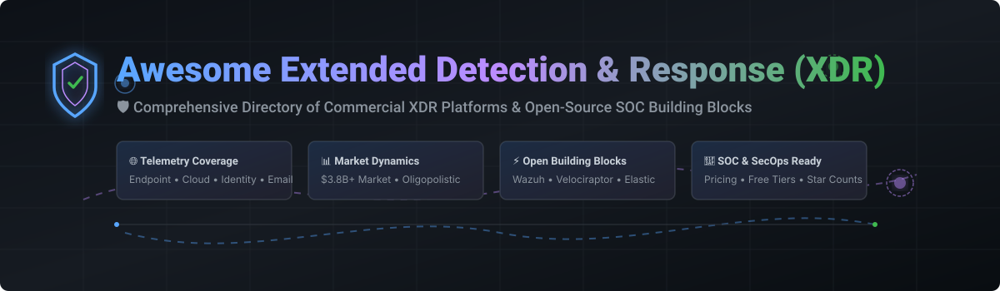

# 🛡️ Awesome Extended Detection and Response (XDR)

  
  
  
  
  

## 📌 Top Extended Detection & Response (XDR) Platforms & Ecosystem

**A Curated List of Commercial SaaS Products, Open-Source GitHub Projects, Detection Engineering Frameworks & SOC Incident Response Stacks**

*Focused on Cross-Layer Telemetry Detection, Threat Hunting, Correlation, Automated Investigation & Incident Response across Endpoints, Identity, Email, Network & Cloud Workloads.*

> **Last updated: September 2026**

---

## 💡 Overview & SEO Highlights

**Extended Detection and Response (XDR)** is an enterprise threat detection and incident response architecture that automatically collects and correlates data across multiple security layers—**endpoints, email, servers, identity management, cloud workloads, and network infrastructure**. By integrating multi-domain telemetry, XDR provides Security Operations Center (SOC) teams with high-fidelity threat visibility, context-rich incident triage, and automated response orchestration.

This repository features:
- 🏢 **Commercial SaaS XDR Solutions**: Market leaders with enterprise pricing, market capitalization / revenue metrics, and free trial access details.
- 🔓 **Open-Source XDR & SIEM Building Blocks**: Battle-tested open tools ranked by live GitHub stargazers.
- ⚡ **SOC Integration Frameworks**: Architectures combining endpoint agents, open SIEMs, rule repositories (Sigma), and SOAR tools.

---

## 📜 Table of Contents

- [🏢 SaaS/Hosted XDR Platforms](#-saashosted-xdr-platforms)
- [🔓 Open-Source GitHub Projects](#-open-source-github-projects)
- [⚙️ Open-Source XDR Architecture Blueprint](#%EF%B8%8F-open-source-xdr-architecture-blueprint)
- [📈 Star History](#-star-history)
- [💖 Support & Contributing](#-support--contributing)
- [⚖️ Disclaimer](#%EF%B8%8F-disclaimer)

---

## 🏢 SaaS/Hosted XDR Platforms

> 📈 **Market Size & Industry Structure:**  
> The global Extended Detection and Response (XDR) market is estimated at **$3.8 Billion to $4.5 Billion** (2025–2026) and is projected to exceed **$9.5 Billion by 2030** (CAGR ~19.5%).  
> The sector is **moderately concentrated / oligopolistic**, dominated by hyper-scale cloud vendors (Microsoft) and enterprise cybersecurity titans (CrowdStrike, Palo Alto Networks, SentinelOne). While vendor consolidation drives broad enterprise adoption, specialization in multi-cloud telemetry and specialized IT/OT integration leaves room for niche SOC platforms.

| Vendor / Platform | Description | Size / Market Cap / Revenue | Starting Pricing Tier | Free Tier / Trial Limit |
| :--- | :--- | :--- | :--- | :--- |
| **[Microsoft Defender XDR](https://www.microsoft.com/en-us/security/business/threat-protection/microsoft-defender-xdr)** | Unified security platform correlating endpoint (MDE), identity (MDI), email (MDO), and cloud apps (Defender for Cloud Apps). | **~$3.34 Trillion** Market Cap *(~$25B+ Cybersecurity Annual Revenue)* | ~$10.60/user/month (Microsoft 365 E5 Security add-on) or included in M365 E5 plan | 30-day Free Trial (up to 25 licenses for M365 E5 trial) |
| **[Cisco XDR](https://www.cisco.com/site/us/en/products/security/xdr/index.html)** | Enterprise XDR platform unifying network telemetry, endpoint data, and third-party security integration across Cisco security suite. | **~$205 Billion** Market Cap *(~$57B Annual Revenue)* | ~$45.00/endpoint/year (Cisco XDR Essentials tier) | 30-day Free Trial (Full platform feature access) |
| **[Palo Alto Cortex XDR](https://www.paloaltonetworks.com/cortex/cortex-xdr)** | Category-pioneering XDR fusing endpoint, NGFW network telemetry, cloud workloads, and identity data into Cortex AI platform. | **~$112 Billion** Market Cap *(~$8.0B Annual Revenue)* | ~$48.00/endpoint/year (Cortex XDR Pro tier) | 30-day Free Trial (Hands-on lab / cloud trial upon request) |
| **[CrowdStrike Falcon XDR](https://www.crowdstrike.com/products/next-gen-siem/falcon-xdr/)** | Cloud-native XDR powered by Threat Graph correlating endpoint, identity, cloud, and 3rd-party log telemetry. | **~$88 Billion** Market Cap *(~$3.9B Annual Revenue)* | ~$59.99/endpoint/year (Falcon Enterprise base bundle) | 15-day Free Trial (No credit card required, up to 100 endpoints) |
| **[Fortinet FortiXDR](https://www.fortinet.com/products/fortixdr)** | AI-driven XDR tightly integrated into the Fortinet Security Fabric for automated cross-domain incident containment. | **~$61 Billion** Market Cap *(~$5.9B Annual Revenue)* | ~$36.00/device/year (FortiEDR/FortiXDR Cloud License) | 30-day Free Trial (Available via FortiCloud partner portal) |
| **[SentinelOne Singularity XDR](https://www.sentinelone.com/platform/)** | Autonomous AI-driven XDR platform offering real-time threat hunting, cross-domain correlation, and automated device rollback. | **~$8.5 Billion** Market Cap *(~$800M Annual Revenue)* | ~$69.00/endpoint/year (Singularity Complete tier) | 30-day Free Trial (Full Singularity platform demo workspace) |
| **[Trend Vision One](https://www.trendmicro.com/en_us/business/products/one-platform.html)** | Enterprise XDR platform providing deep coverage across endpoints, email security, servers, OT, and hybrid cloud environments. | **~$7.2 Billion** Market Cap *(~$1.7B Annual Revenue)* | ~$52.00/user/year (Trend Vision One Endpoint & Email Protection) | 30-day Free Trial (Full platform access for up to 50 endpoints) |
| **[Sophos XDR](https://www.sophos.com/en-us/products/sophos-edr)** | Synchronized detection and response platform for mid-market and enterprise SOCs, integrating network, endpoint, and cloud. | **~$4.0 Billion** Private Equity Valuation (Thoma Bravo) *(~$1.2B Annual Revenue)* | ~$48.00/user/year (Sophos Intercept X Advanced with XDR) | 30-day Free Trial (Unlimited endpoint testing) |
| **[Check Point Infinity XDR](https://www.checkpoint.com/infinity/xdr/)** | Coordinated prevention and XDR engine aggregating security events across network, cloud, endpoint, mobile, and IoT. | **~$23 Billion** Market Cap *(~$2.5B Annual Revenue)* | ~$42.00/user/year (Infinity Threat Prevention & XDR suite) | 30-day Free Trial (Check Point Infinity Portal access) |
| **[Trellix XDR](https://www.trellix.com/platform/xdr/)** | Combined enterprise XDR architecture incorporating McAfee and FireEye telemetry engines for advanced threat defense. | **~$3.5 Billion** Private Equity Valuation (Symphony Technology Group) | ~$54.00/endpoint/year (Trellix XDR Core Bundle) | 30-day Free Trial (Enterprise evaluation instance upon approval) |

---

## 🔓 Open-Source GitHub Projects

> Open-source security projects provide foundational modules for SOC teams to build self-hosted, custom Extended Detection & Response capabilities. Projects below are sorted by **GitHub Star Count (Descending)** 🌟.

| Open-Source Project | Stargazers Badge | Description & Core XDR Capabilities |
| :--- | :--- | :--- |
| **[Elasticsearch / Elastic Security](https://github.com/elastic/elasticsearch)** |  | Core distributed indexer and analytics engine powering Elastic Security XDR, SIEM detection rules, timeline hunting, and Fleet endpoint management. |
| **[osquery](https://github.com/osquery/osquery)** |  | SQL-powered operating system instrumentation framework for telemetry extraction, compliance monitoring, and incident response pipelines across Windows, macOS, and Linux. |
| **[Wazuh](https://github.com/wazuh/wazuh)** |  | Premier open-source XDR & SIEM platform featuring a unified endpoint agent, automated log analysis, File Integrity Monitoring (FIM), active response, and vulnerability detection. |
| **[OpenSearch](https://github.com/opensearch-project/OpenSearch)** |  | Community-driven, open-source search and analytics suite powering OpenSearch Security Analytics for log ingestion, alert correlation, and security detection. |
| **[Sigma](https://github.com/SigmaHQ/sigma)** |  | Generic Signature Format for SIEM and XDR detection rules ("Detection-as-Code"), allowing rules to be converted across Splunk, Elastic, Wazuh, QRadar, and Defender. |
| **[OpenCTI](https://github.com/OpenCTI-Platform/opencti)** |  | Open Cyber Threat Intelligence platform enabling SOCs to structure, store, organize, and correlate threat intelligence indicators (STIX2) directly with XDR telemetry. |
| **[Falco](https://github.com/falcosecurity/falco)** |  | Cloud-native runtime security tool and de-facto Kubernetes threat detection engine parsing Linux kernel system calls (eBPF) to alert on malicious behavior. |
| **[Zeek](https://github.com/zeek/zeek)** |  | Passive, open-source network security monitoring platform generating structured transaction logs, protocol analysis, and file extraction for network detection layer. |
| **[Security Onion](https://github.com/Security-Onion-Solutions/securityonion)** |  | Comprehensive Linux distribution for threat hunting, enterprise security monitoring, and log management, bundling Suricata, Zeek, Wazuh, and CyberChef. |
| **[Velociraptor](https://github.com/Velocidex/velociraptor)** |  | Advanced digital forensics and incident response (DFIR) platform utilizing Velociraptor Query Language (VQL) for fleet-wide live threat hunting and forensic artifact collection. |
| **[TheHive](https://github.com/TheHive-Project/TheHive)** |  | Scalable, open-source Security Incident Response Platform (SIRP) designed for SOC analysts to collaborate, manage cases, track observables, and trigger automated containment. |
| **[Shuffle](https://github.com/Shuffle/Shuffle)** |  | Open-source Security Orchestration, Automation, and Response (SOAR) platform enabling workflow automation, OpenAPI integration, and response playbook execution. |
| **[OSSEC](https://github.com/ossec/ossec-hids)** |  | Host-based Intrusion Detection System (HIDS) engine providing log analysis, integrity checking, Windows registry monitoring, rootkit detection, and real-time alerting. |
| **[Cortex (TheHive Project)](https://github.com/TheHive-Project/Cortex)** |  | Open observable analysis and active response engine pairing with TheHive to automate IP/hash enrichment via threat intel analyzers and execute responder scripts. |

---

## ⚙️ Open-Source XDR Architecture Blueprint

To assemble a resilient, self-hosted Extended Detection & Response pipeline using open-source tools:

1. **Endpoint Telemetry & HIDS Layer**: Deploy **Wazuh Agent** or **osquery** across servers and workstations for endpoint process monitoring, file integrity tracking, and active mitigation.
2. **Network & Container Visibility**: Instrument networks with **Zeek** and **Security Onion**, while leveraging **Falco** for Linux kernel/Kubernetes runtime security.
3. **Log Aggregation & Detection Engine**: Centralize telemetry into **Elasticsearch** or **OpenSearch**, executing community **Sigma** rules converted into native query languages.
4. **Threat Intelligence Correlation**: Ingest IOCs from **OpenCTI** to automatically correlate incoming network/endpoint logs with known threat actor TTPs.
5. **Incident Case Management & SOAR**: Route high-fidelity alerts to **TheHive**, enrich observables via **Cortex**, and automate containment playbooks with **Shuffle**.

---

## 📈 Star History

---

## 💖 Support & Contributing

Contributions are warmly welcomed! If you know of outstanding XDR tools, detection frameworks, or open-source DFIR projects that belong here:

1. 🍴 **Fork** the repository.
2. 📝 **Add/Update** entries in `README.md` following our structured table format.
3. 🚀 **Submit a Pull Request** with a clear explanation of your additions.

### 🌟 Show Your Support
- **Star** ⭐️ this repository if you find it helpful for your SOC team or research!
- **Share** 📢 with fellow cybersecurity analysts, detection engineers, and SecOps teams.
- **Sponsor** ☕ Buy us a coffee and support open-source cybersecurity curation on the [GitHub Sponsor Dashboard](https://github.com/sponsors/ishandutta2007).

---

## ⚖️ Disclaimer

- This list is **community-curated** for educational, SecOps engineering, and informational purposes only.
- Mention of specific enterprise SaaS platforms or open-source projects does not constitute official endorsement.
- Extended Detection and Response systems involve active threat mitigation. Misconfigurations can cause service disruption or unmitigated security breaches. Ensure thorough testing in sandbox environments prior to enterprise deployment.

---

  <b>Made with ❤️ for SOC Analysts, Threat Hunters, &amp; Open-Source Cybersecurity Advocates worldwide.</b>

